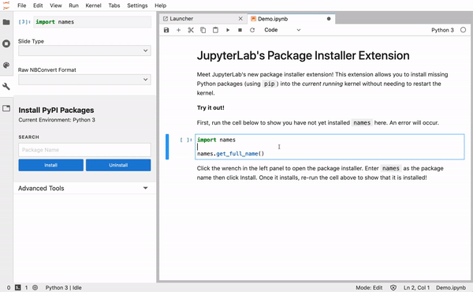

# Meet JupyterLab Package Installer 👋

[](https://mybinder.org/v2/gh/jupytercalpoly/jupyterlab-pkginstaller/master?urlpath=lab/tree/notebooks/Demo.ipynb)

**jupyterlab-pkginstaller** is a JupyterLab UI extension that installs the packages you need (via pip) for your active kernel. ✨
You can look for a package in the search bar and install it with just a button-click.




## Prerequisites

* JupyterLab

## Installation

```bash
jlpm
jlpm build
jupyter labextension link .
jlpm
jupyter lab build
```
